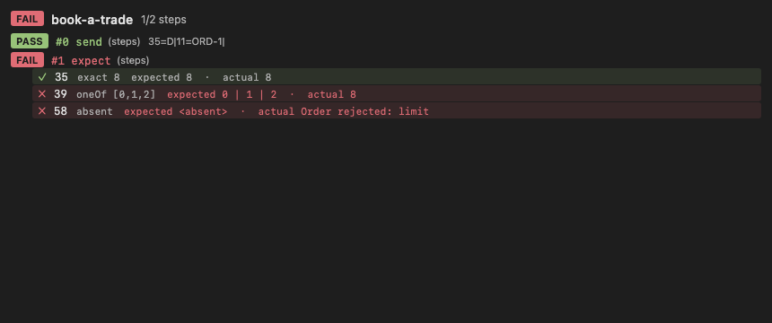
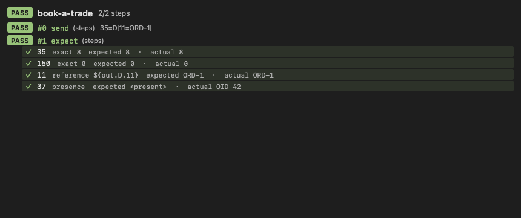
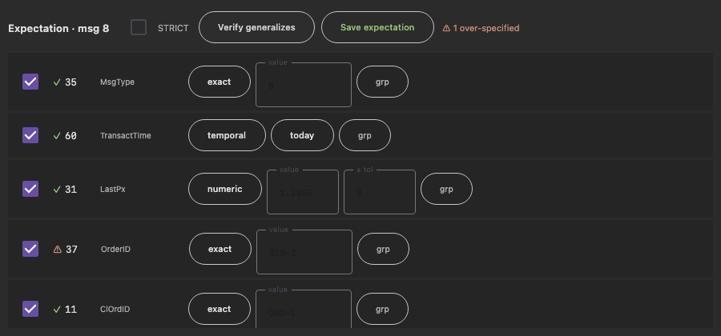
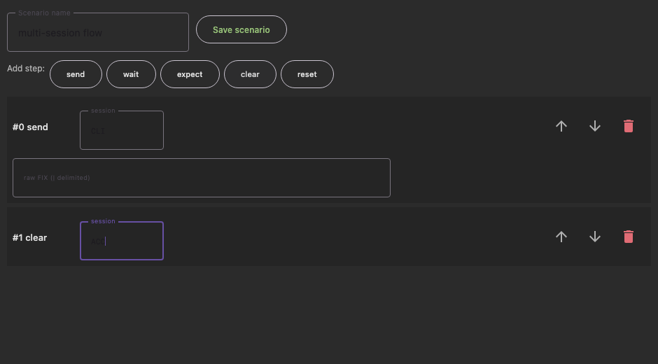

# Repeatable Scenarios — Phase 3 (Run) delivery evidence

Phase 3 brings the feature into the app: a **Scenarios panel** to run/manage scenarios, and the
**per-tag red/green run-results rendering** — the in-app answer to "where does a failed assertion
show up".

## What shipped

| Plan item | Status | Where |
|-----------|--------|-------|
| 3.5 Run-results red/green overlay | ✅ | `ui/ScenarioResultsView.kt` (per-step + per-tag rows, expected vs actual) |
| Scenarios panel (run / list / delete / build) | ✅ | `ui/ScenariosDialog.kt`, toolbar ▶ button (`ui/Toolbar.kt`), `ui/App.kt` wiring |
| Author by pasting JSON | ✅ | `ScenariosDialog` → `FixMessageViewModel.saveScenarioJson` |
| Run off the UI thread → result state | ✅ | `FixMessageViewModel.runScenario` (`scenarioResult` / `scenarioRunning` flows) |
| Shared runner host (UI + control) | ✅ | `viewmodel/ViewModelScenarioHost.kt` (also backs `fixtool_run_scenario`) |
| **3.1** matcher chips | ✅ | `ui/MatcherEditor.kt` (editable type dropdown + per-type fields) |
| **3.1** live green/red preview | ✅ | `ui/ExpectationBuilder.kt` (per-tag evaluate against the golden) |
| **3.2** capture / auto-seed + group-by-identity | ✅ | `ExpectationDrafts.fromRaw` (dictionary seed) + per-row `GroupPath` editor; tool `fixtool_capture_expectation` |
| **3.3** two-instance "verify generalizes" | ✅ | `ExpectationBuilder` "Verify generalizes" (flags over-specified tags vs a 2nd instance) |
| **3.4** visual scenario builder | ✅ | `ui/ScenarioBuilder.kt` (add/reorder/remove Send/Wait/Expect/Clear/Reset) |
| **3.6** per-step multi-session authoring | ✅ | `ScenarioBuilder` per-step `session` field |

**Nothing deferred.** All of 3.1–3.6 are built and tested.

## Rendered output (real Compose UI, captured in a test harness)

A **failed** run — the `expect` step is red, and each asserted tag shows expected vs actual
(`oneOf` and `absent` failed):



An all-**green** run:



The **expectation builder** — a captured message, one editable matcher chip per tag, a live green ✓
preview, and `Verify generalizes` flagging tag 37 (`⚠ 1 over-specified` — left as `exact` on an
OrderID that changes between instances):



The **visual scenario builder** — steps added by clicking, each with its own session (`CLI` initiator,
`ACC` acceptor — multi-session in one scenario):



## How to reproduce

```
# unit + UI (incl. the PNG captures under build/scenario-screenshots/)
./gradlew jvmTest \
  --tests "com.knapsack.fixtool.ui.MatcherEditorTest" \
  --tests "com.knapsack.fixtool.ui.ExpectationBuilderTest" \
  --tests "com.knapsack.fixtool.ui.ScenarioBuilderTest" \
  --tests "com.knapsack.fixtool.ui.ScenarioResultsViewTest" \
  --tests "com.knapsack.fixtool.service.Scenario*" \
  --tests "com.knapsack.fixtool.ui.AppIntegrationTest" \
  --tests "com.knapsack.fixtool.ui.ToolbarDictionaryValidationTest"

# live-session runner (isolated — heavy QuickFIX integration tests are retried on CI)
./gradlew jvmTest --tests "com.knapsack.fixtool.integration.ScenarioIntegrationTest"
./gradlew jvmTest --tests "com.knapsack.fixtool.integration.ControlServerIntegrationTest"
```

## Result — 0 failures

| Test class | Tests | What it proves |
|------------|------:|----------------|
| `MatcherEditorTest` | 1 | switching matcher type emits a matcher of the chosen type (3.1) |
| `ExpectationBuilderTest` | 2 | seeded chips + live preview render; save emits the expectation; **verify generalizes** flags the over-specified tag (3.1/3.2/3.3) |
| `ScenarioBuilderTest` | 1 | builds a 2-step scenario from clicks with **different sessions per step** (3.4/3.6) |
| `ScenarioResultsViewTest` | 2 | results view renders PASS green and a failing tag red with expected/actual; writes the PNGs above (3.5) |
| `ScenarioRunnerTest` / `ScenarioCodecTest` | 5 / 2 | runner + codec (still green after the `ViewModelScenarioHost` refactor) |
| `ScenarioIntegrationTest` | 5 | live save/list/run/delete + JUnit + MCP, through the shared host |
| `ControlServerIntegrationTest` | 29 | full control surface still green (34 MCP tools) |
| `AppIntegrationTest` / `ToolbarDictionaryValidationTest` | — | App + Toolbar still render after the Scenarios wiring |

> Note: running all heavy QuickFIX integration tests together in one JVM can flake on
> session-registry/timing contention (they pass individually); CI retries them. The unit/UI
> tests are deterministic.

## Quality gates
- `./gradlew compileTestKotlinJvm` — clean.
- `./gradlew detekt` — no violations in any new Phase 3 file (`ScenarioResultsView`, `ScenariosDialog`,
  `ViewModelScenarioHost`, `MatcherEditor`, `ExpectationBuilder`, `ScenarioBuilder`, `RawMessageView`).
  The verbose builder composables carry a focused file-level `@Suppress` for the presentation-only
  `MaxLineLength`/`LongParameterList` rules (idiomatic for Compose). The remaining detekt output is
  limited to the pre-existing large `App.kt` / `Toolbar.kt` composables.
